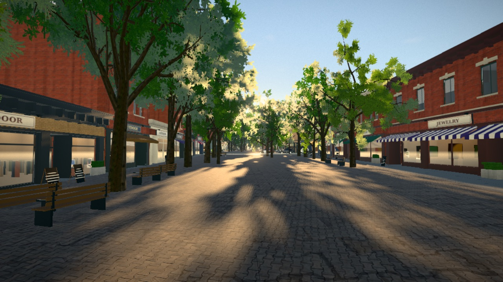

# FLK VI

**Every road is a way out.**

FLK VI is an independent browser open-world game set in real US places. Pick a spot on the map and the game
builds a photoreal 3D version of it from open data: real streets, real building footprints, real
terrain, plus an inferred network of surveillance cameras. Your job is to take the cameras down
(spray them, bag them, or cut the poles) and build the longest streak you can before the police
catch up with you.



**Play:** <https://omniharmonic.github.io/groundtruth/>

> Desktop only: it needs a keyboard, a mouse and WebGL 2, and phones and tablets are turned away at
> the title screen. A discrete GPU is recommended; it is developed and tested mainly in Chromium
> browsers.

## Controls

| On foot | | Takedown | |
|---|---|---|---|
| Move | `W` `A` `S` `D` | Disable camera (hold) | `E` |
| Look | Mouse | Cut down pole (hold) | `R` |
| Sprint / Jump | `Shift` / `Space` | Scan: show vision cones (hold) | `Q` |
| Crouch / Walk (toggle) | `C` / `X` | Binoculars (hold) | `B` |
| Punch / shove | `G` or left click | Camera map | `M` or `Tab` |
| Enter / exit vehicle | `F` | Photo mode | `P` |

| Driving | | System | |
|---|---|---|---|
| Throttle / brake | `W` / `S` | Pause, settings, credits | `Esc` |
| Steer | `A` / `D` | Capture mouse | Click |
| Handbrake / Horn | `Space` / `H` | Cycle weather | `F7` |
| Look back / Reset car | `V` / `R` | | |

## Core loop and scoring

1. **Scout.** Use the camera map, binoculars and scan to find cameras and see what each one covers.
2. **Take down.** Disabling a camera (`E`) is quick and quiet. Cutting it down (`R`) is worth more
   but uses a grinder charge. Pole cameras, PTZ domes, clusters and towers pay progressively more,
   and cameras that cover other cameras pay a bonus.
3. **Stay unseen.** If cameras, bystanders or officers spot you, heat rises and police respond with
   foot patrols, cruisers, a helicopter and drones. The network also fights back by installing new
   cameras over time.
4. **Bank.** A clean, unseen takedown banks its points immediately. Anything done under heat stays
   *hot* until you lose the police. Get arrested and your hot points are gone.

Every takedown adds to your **streak**, and the streak raises your score multiplier (+0.1× per
takedown, up to 3×). Free-roam mode lets you explore without a run.

## Cities

Thirteen featured places have pre-baked starting areas:

Boulder (Pearl Street) · San Francisco (Mission) · New York (Greenwich Village) · New Orleans
(French Quarter) · Chicago (The Loop) · Phoenix (Downtown) · Seattle (Capitol Hill) · Austin (South
Congress) · Savannah (Historic District) · Miami Beach (South Beach) · Denver (LoDo) · Santa Fe · Moab

**Or drop anywhere in the US.** Click any point on the picker map, or search for a place, and the
World Compiler builds that location live in your browser, including rural places without city streets. Live
compiles depend on the public Overpass API servers, so they can be slow or fail when those servers
are busy; the game retries against fallback mirrors. Featured starting areas use bundled recipes.

New districts load as you approach the edge, with terrain, buildings, collision, AI routes and
cameras. This works on static hosting. A safety boundary remains until the next section is ready;
slow map servers can cause a wait. Distant districts unload and recent recipes are cached locally.

## How it works

```
OpenStreetMap (Overpass API) ─┐
                              ├─► World Compiler ─► Recipe (JSON) ─► Client assembly ─► Game
AWS Terrain Tiles (Terrarium) ┘   (Web Worker)       meters, +X east,   roads, buildings,
                                                     +Z south, +Y up    terrain, props, AI
```

- **World Compiler** (`src/compiler/`) fetches OSM features and elevation tiles for about 1 km²,
  then infers what the data does not say: building style, era, material, roof and height from OSM
  tags plus regional priors; street trees and vegetation by climate; props; and a plausible camera
  network. It is pure TypeScript with injected IO, so the same code runs in a Web Worker in the
  browser and under Node for pre-baking.
- **Recipe** (`src/core/types.ts`) is the contract between compiler and client: a single JSON
  document in local meters with the origin at the spawn point.
- **Client** assembles the recipe into a world with instanced and merged geometry, PBR materials,
  physics colliders and a road graph for traffic and police.

| Directory | Responsibility |
|---|---|
| `src/core/` | Recipe types, service interfaces, event bus, game loop |
| `src/compiler/` | Runtime World Compiler (OSM + terrain to recipe) and featured-city list |
| `src/world/` | Terrain, roads, areas, vegetation, props, landmarks; `buildings/` generates facades |
| `src/render/` | Renderer, sky and time of day, weather, post-processing |
| `src/game/` | Player, character controller, camera, vehicles |
| `src/ai/` | Heat, police, traffic, pedestrians, helicopter |
| `src/surveillance/` | Cameras, vision, takedowns, scoring, drones |
| `src/ui/`, `src/audio/` | Picker, loading, HUD, maps, menus, photo mode; audio |
| `src/assets/` | Asset library and loaders |
| `tools/` | Node scripts: city baking, thumbnails, license check |

## Local development

Requires Node 22 or newer.

```sh
npm install
npm run dev            # http://127.0.0.1:5173
```

Useful URL parameters:

- `?autostart&city=<id>` skips the picker and loads a featured city (`boulder`, `sf-mission`,
  `nyc-village`, `nola-quarter`, `chicago-loop`, `phoenix-downtown`, `seattle-caphill`,
  `austin-soco`, `savannah`, `miami-beach`, `denver-lodo`, `santa-fe`, `moab`).
- `&weather=clear|overcast|rain|storm|fog` selects weather; `&nostream` disables automatic district requests for debugging.
- `&nointro` skips the arrival fly-in; `&time=18.5` sets the starting hour; `&rain=1` forces rain.

Type-check with `npm run typecheck` and build with `npm run build`.

Regression checks:

```sh
npm run test:ai                       # 35 traffic, signals and heat checks
npm run test:deep                     # 5 rural compiler, coordinate and graph checks
PORT=5200 npm run dev -- --strictPort  # shared server, in a separate terminal
npm run test:browser                  # 32 real-browser movement, collision and asset checks
npm run test:integration              # 36 streaming, combat, damage and weather checks
npm run test:world -- sf-mission       # full city, quality settings, rendering and takedown checks
```

The browser checks require `agent-browser` on PATH and use `tools/browser.sh` to serialize Chromium sessions.
See [the polish audit](docs/polish-audit.md) and [world expansion notes](docs/world-expansion.md)
for changes, validation and remaining engineering work.

Deployment to GitHub Pages runs
from `.github/workflows/deploy.yml` on every push to `main`.

## Baking cities

Featured cities live in `src/compiler/cities.ts`. To rebuild their recipes and picker thumbnails:

```sh
node --experimental-strip-types tools/compile-city.ts boulder     # or several ids, or: all
node --experimental-strip-types tools/compile-city.ts --lat 40.01 --lon -105.27 --id custom --name "Somewhere"
node --experimental-strip-types tools/thumbs.ts                   # regenerate public/recipes/thumbs/
```

Output goes to `public/recipes/<id>.json`.

## Tech stack

- [Three.js](https://threejs.org) (WebGL 2) with [postprocessing](https://github.com/pmndrs/postprocessing)
  and [N8AO](https://github.com/N8python/n8ao) for ambient occlusion
- [Rapier](https://rapier.rs) physics (`@dimforge/rapier3d-compat`)
- [ez-tree](https://github.com/dgreenheck/ez-tree) procedural trees
- [Leaflet](https://leafletjs.com) for the location picker
- TypeScript and Vite, vanilla DOM and CSS for UI, Web Audio with procedural synthesis for sound

## Credits and licenses

**Source code:** MIT, © 2026 Benjamin Life. See [LICENSE](LICENSE). The license covers the code only;
the data and assets below carry their own licenses.

**Map data:** © [OpenStreetMap contributors](https://www.openstreetmap.org/copyright), under the
[Open Database License (ODbL) 1.0](https://opendatacommons.org/licenses/odbl/). The baked recipes in
`public/recipes/` are derivative databases and are ODbL-licensed; see
[public/recipes/LICENSE.md](public/recipes/LICENSE.md). Live data comes from the Overpass API.

**Terrain:** [AWS Terrain Tiles](https://registry.opendata.aws/terrain-tiles/) (Mapzen / Tilezen).
3DEP (formerly NED) and NED topobathy courtesy of USGS; SRTM courtesy of NASA and USGS; GMTED2010
courtesy of USGS; ETOPO1 courtesy of NOAA.
[Full attribution](https://github.com/tilezen/joerd/blob/master/docs/attribution.md).

**Location picker:** base map tiles © Esri (World Dark Gray Canvas; Esri, HERE, Garmin,
© OpenStreetMap contributors, and the GIS user community). Search and reverse geocoding by
[Nominatim](https://nominatim.org/), © OpenStreetMap contributors.

**Assets:** all third-party assets are [CC0 1.0](https://creativecommons.org/publicdomain/zero/1.0/)
(public domain): textures, HDRIs and props from [Poly Haven](https://polyhaven.com) and
[ambientCG](https://ambientcg.com); characters and animations by [Quaternius](https://quaternius.com);
vehicles and sound effects by [Kenney](https://kenney.nl). Each file's source and author is listed
in [public/assets/LICENSES.json](public/assets/LICENSES.json); run `npm run check:licenses` to verify
coverage. Everything else (buildings, signage, surveillance hardware, most audio) is generated
procedurally in code.

**Fiction:** Groundtruth is a game. It is set in real places but depicts no real brands, agencies or
insignia, and camera placements are invented. Don't do this in real life.
